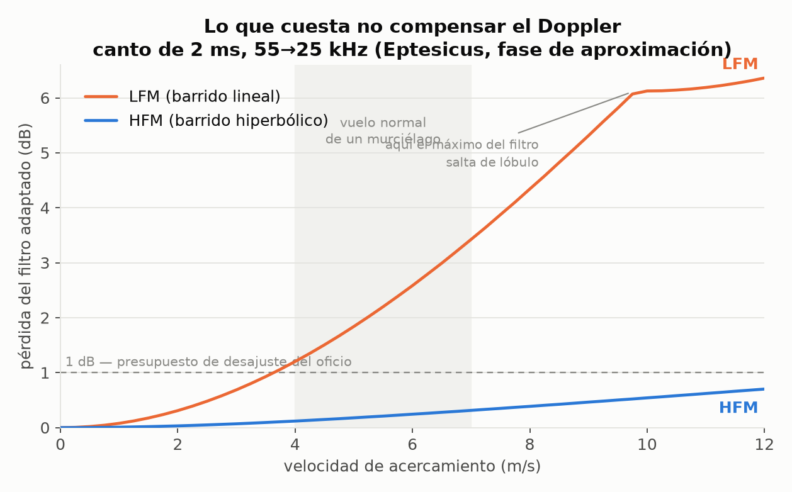
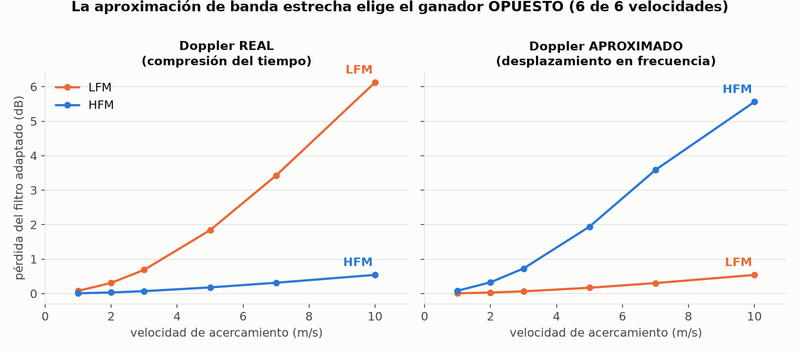
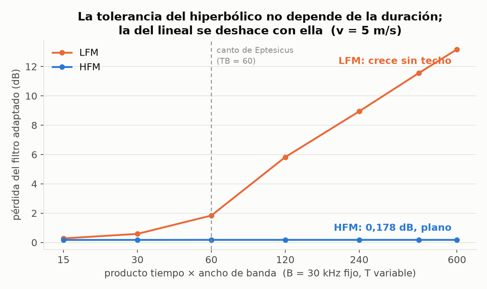
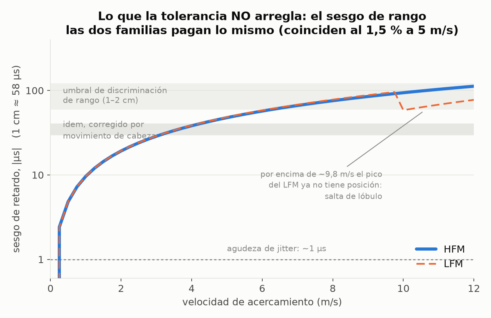
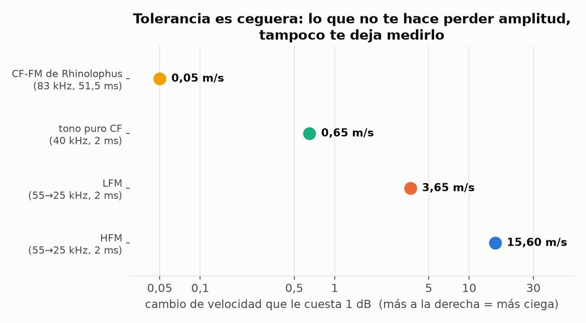

# Bat-call Doppler tolerance, measured

**The headline:** if you compare a linear (LFM) against a hyperbolic (HFM) sweep with the
**narrowband** ambiguity function — Doppler as a frequency shift — you pick the **opposite** winner
from the one the real, wideband Doppler picks. Not a smaller effect. The opposite one, at **6 of 6**
closing speeds tested.

At bat parameters (2 ms sweep, 55 → 25 kHz, time-bandwidth product 60, closing speed 5 m/s):

| model of Doppler | LFM loss | HFM loss | "winner" |
|---|---|---|---|
| **wideband** (echo is time-*scaled* by η = (c+v)/(c−v)) | **1.840 dB** | **0.178 dB** | HFM |
| narrowband (echo is frequency-*shifted* by 2vf_c/c) | 0.168 dB | 1.942 dB | LFM |

Each waveform family is tolerant of exactly the Doppler model that matches its own symmetry. An LFM
tolerates a *shift* (the ambiguity ridge slides along delay). An HFM tolerates a *scaling* (scaling
an HFM is the same as delaying it). Real echoes scale. The numbers are nearly swapped between the
two rows, which is what makes the approximation dangerous rather than merely inaccurate: it's not
conservative in either direction.

The regime is set by **(2v/c)·T·B**, the classic LFM Doppler-tolerance criterion. A big brown bat's
approach call sits at **1.75** — not ≪ 1. Underwater sonar sits in the same place (c ≈ 1500 m/s, a
20 m/s closing speed, a long pulse), which is why this is not only a bat story.

## Three results that are not in the textbook framing

**1. Doppler tolerance buys amplitude, not range.** Both families suffer *the same* range bias, to
within 1.5 %: 48.39 µs (LFM) vs 47.67 µs (HFM) — 0.83 vs 0.82 cm. To first order in ε = η−1 the bias
is

```
Δ ≈ ε · T · f_end / B
```

independent of the phase law, where `f_end` is the frequency at the end of the sweep. Tested
post-hoc on 18 cases (up-sweeps and down-sweeps, B from 10 to 60 kHz, T from 1 to 5 ms, v from 2 to
9 m/s): median relative error **3.3 %** for HFM and **1.9 %** for LFM. *Domain:* it holds for the
LFM only while the LFM still has a peak — above ≈ 9.8 m/s in the reference call its correlation peak
hops between lobes and its bias stops being defined (two of the 18 LFM cases sit there and miss by
20–35 %; the HFM never does, because its peak never degrades).

For scale: an approaching target is perceived **closer than it is**, by ~48 µs at 5 m/s. Eptesicus
detects echo-delay *changes* of ~1 µs and discriminates range at 60–120 µs (30–40 µs once head
movement is accounted for). So the uncompensated Doppler bias is ~48× the jitter acuity and about
one range JND — a systematic offset that grows with closing speed, exactly when range matters most.

**2. The HFM's residual loss is entirely band-edge, and none of it is phase.** Replace the replica
with the emitter's *own phase law continued* over a support of matched duration T/η and the HFM's
normalized correlation goes to **0.999999992** (loss 4·10⁻⁸ dB) while the LFM only reaches
**0.823260** (1.689 dB — 92 % of its total 1.840 dB). So the HFM's 0.178 dB comes from the echo
bringing back frequencies (ηf₁) the call never contained; its phase law contributes nothing. And the
HFM's loss is **flat at 0.178 dB across TB from 15 to 600**, while the LFM's grows from 0.28 to
13.18 dB. HFM tolerance doesn't depend on pulse duration; LFM tolerance is destroyed by it.

**3. Tolerance is blindness.** The closing-speed change that costs a waveform 1 dB:

| waveform | speed change costing 1 dB |
|---|---|
| CF-FM of *Rhinolophus* (83 kHz, 51.5 ms) | **0.05 m/s** |
| pure CF tone (40 kHz, 2 ms) | 0.65 m/s |
| LFM (55 → 25 kHz, 2 ms) | 3.65 m/s |
| HFM (55 → 25 kHz, 2 ms) | 15.60 m/s |

A 300× span across the bat repertoire, ordered exactly as the biology: the horseshoe bat — the one
that *does* Doppler-shift compensation and has an acoustic fovea — carries the call that cannot
afford 0.05 m/s of uncorrected speed. What doesn't cost you amplitude also can't tell you the
velocity. Tolerance and measurement are the same axis read from opposite ends.

And Doppler compensation is not a refinement for that bat: an uncompensated *Rhinolophus* call loses
**33.6 dB**, which is *worse* than throwing its 50 ms CF component away and correlating the 1.5 ms FM
tail alone (1.15 dB). The mismatched CF doesn't contribute zero — it actively captures the global
maximum of the filter output at the wrong delay (−1227 µs here). A matched filter that keeps
unusable energy is worse than one that discards it.

## Figures







## How to check it

```
python3 run_prereg.py     # the pre-registered measurements  -> res_v232.json
python3 posthoc.py        # the three post-hoc checks        -> res_v232_posthoc.json
python3 figuras.py        # the five figures
```

Needs only `numpy` + `scipy` (and `matplotlib` for figures). `chirp.py` holds the phase laws and the
measurement; nothing else.

The echo is never resampled. Signals are defined by their phase function, so the wideband echo is
evaluated **exactly** at the scaled argument `s(η(t−τ))`; the support compresses to T/η the way a
real echo does. Peaks are located by parabolic interpolation on the complex-correlation magnitude
(which *is* the envelope, so there's no carrier to alias).

## Controls, because a number without one isn't a measurement

Every claim here was pre-registered before the numerics existed ([PREREGISTRO.md](PREREGISTRO.md),
in Spanish) with sealed thresholds, and all controls were run:

- **Null:** at v = 0, loss = −0.000e+00 dB and bias = 0.0000 µs exactly (the 51.5 ms CF-FM gives
  2.9·10⁻¹⁵ dB, float64 rounding).
- **Positive, analytic:** the LFM's −3 dB compressed width comes out 29.451 µs against 0.886/B =
  29.533 µs (0.3 %); the narrowband ridge slope comes out 66.507 ns/Hz against T/B = 66.667
  (0.24 %), R² = 1.000000 over 21 points.
- **Positive, catastrophe:** a 2 ms pure tone at 40 kHz loses 16.58 dB at 5 m/s. An apparatus that
  can't see *that* can't measure loss.
- **Sign:** with the target receding, both biases flip sign and the losses are unchanged.
- **Construction:** the continued-law replica of result 2 returns exactly 1.000000000 at η = 1.
- **Stability:** identical to 0.002 dB at fs = 1, 2 and 4 MHz. A rectangular envelope raises both
  losses (2.932 / 0.343 dB) without changing the ordering — so the effect is not an envelope
  artifact, but its *size* depends on the taper, and the taper is declared.

Three of my seven sealed predictions **missed**, and the misses are in `PREREGISTRO.md` with their
verdicts:

- I predicted the LFM's range bias at 65–95 µs. It's 48.4 µs. My algebra was right — for the
  *narrowband* model, which the code reproduces at 77.54 µs. I derived the prediction in the
  approximation I was setting out to discredit.
- I predicted the narrowband model would underestimate the LFM loss by > 2 dB. It underestimates by
  1.672 dB. The mechanism held with room to spare (it captures 9 % of the loss and lands on the
  other side of the 1 dB budget); the 2.0 threshold was mine and I invented it.
- I predicted an uncompensated CF-FM call would lose 12–20 dB, reasoning that the mismatched CF
  contributes nothing. It loses 33.6 dB, because it contributes worse than nothing.

## What this is NOT

Idealized waveforms at published parameters, **not recordings**. No noise, no atmospheric
absorption, no beam pattern, no harmonics, and no bat auditory system — the bat is not a matched
filter and nobody has shown it is one. The verdict is about **waveform families in the bat parameter
regime**, not about any individual animal. Call parameters are representative of *Eptesicus fuscus*
approach-phase and *Rhinolophus ferrumequinum* CF-FM calls as described in the literature; the
biology here is context for the signal processing, not a claim about behaviour.

## Prior art I could actually read

- R. A. Altes & E. L. Titlebaum, *Bat signals as optimally Doppler tolerant waveforms*, JASA 48(4B),
  1014 (1970) — established that hyperbolic sweeps are the Doppler-tolerant optimum and that bat
  calls resemble them. The tolerance claim is theirs; what's measured here is what it costs and
  where it goes at real bat parameters.
- A. Balleri et al., *Ambiguity function and accuracy of the hyperbolic chirp: comparison with the
  linear chirp*, IET Radar Sonar Navig. (2017) — **paywalled; I got a 403 and did not read it.** It
  plainly overlaps this ground, so treat my "not in the textbook framing" as "not in the framing I
  could reach", and check that paper before citing me for novelty.
- Behavioural acuity figures for *Eptesicus fuscus* (≈1 µs delay-change acuity; 1–2 cm range
  discrimination, 0.5–0.7 cm corrected for head movement) come from the Simmons group's
  jittered-echo work.

## Who this is for

Anyone who evaluates or teaches waveform design with the **narrowband** ambiguity function while
working at |v|/c above ~10⁻³ — active sonar, ultrasonic ranging, bat and dolphin bioacoustics. The
one-line takeaway is the criterion: if **(2v/c)·T·B** is not ≪ 1, the narrowband ambiguity function
is not an approximation of your problem, it's a different problem, and it can invert your ranking.

Released **CC0** — public domain. Take it, break it, correct it. If you find an error, open an issue;
being corrected is cheaper than being wrong in public.
